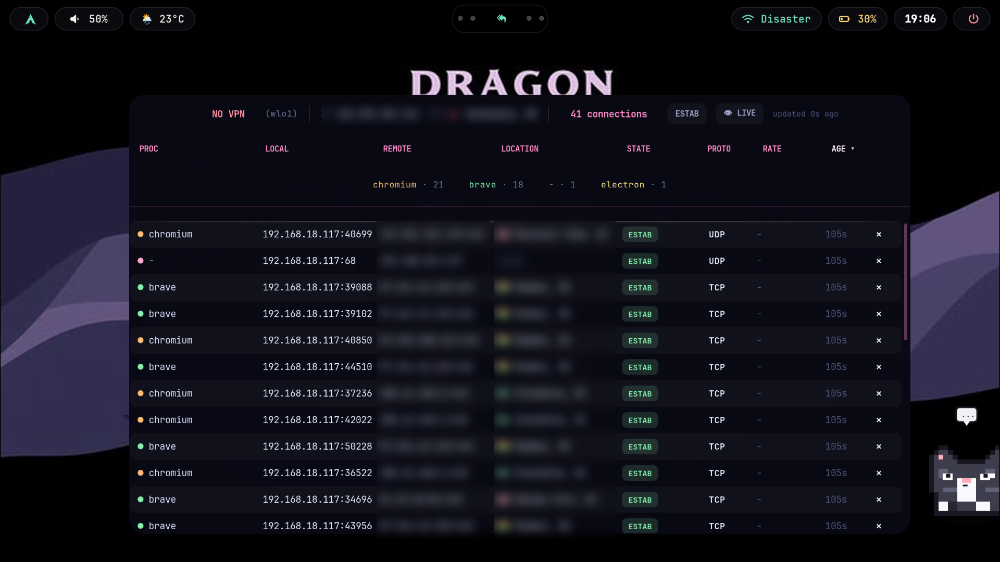
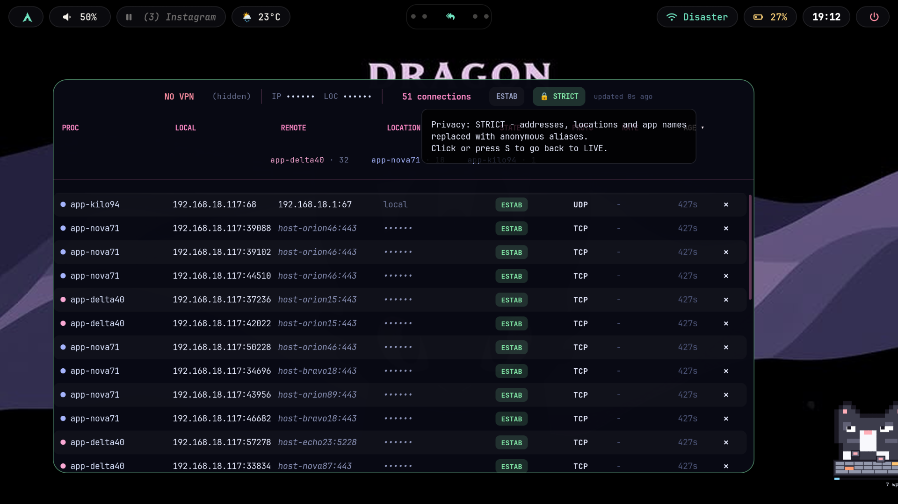
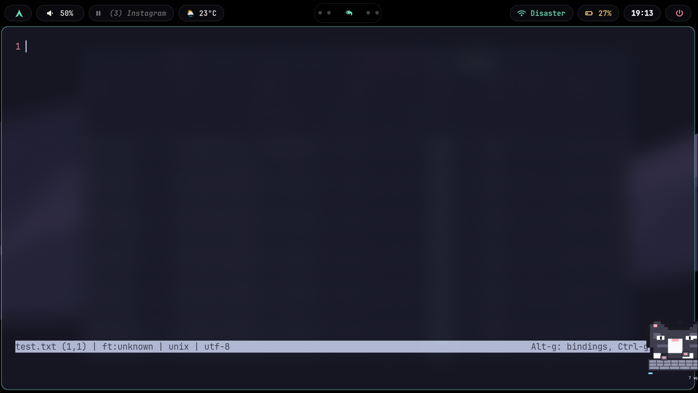

# netmon-panel

A live network-connections overlay for Wayland compositors (Hyprland, Sway, etc.), pinned to the wallpaper layer via `gtk-layer-shell`. Shows every active connection on your machine — process, local/remote address, geolocated location with a flag, connection state, protocol, live bandwidth, and age — right on your desktop.

<details>
<summary><h3>Screenshare privacy modes (click to expand screenshots)</h3></summary>

**`LIVE` — everything visible** (remote addresses and locations blurred here for the README only):



**`SAFE` — call-friendly**: public IP, remote IPs and city redacted, country flag kept; process names, ports, states, rates, ages and sorting all still work.


**`STRICT` — hard privacy**: addresses, locations and app names become stable anonymous aliases (`host-orion46`, `app-nova71`); tooltips explain the mode, kill actions are disabled.



**Behind another window**: the panel sits on the wallpaper layer, so opening any app simply covers it — nothing floats over your shared screen.



</details>

## Features

- **Per-connection detail**: process name + pid, local/remote address, protocol (TCP/UDP), connection state (`ESTAB`, `LISTEN`, `TIME-WAIT`, etc.)
- **Geolocation**: remote IPs are resolved to city + country via [ip-api.com](https://ip-api.com), shown with a flag emoji, cached in-memory so repeat IPs don't re-query
- **Live bandwidth**: per-connection transfer rate, computed from `ss -i` counters between polls
- **New-connection flagging**: connections younger than 5s get a small marker so a freshly-opened socket catches your eye
- **All-states toggle**: default view is established connections only; click `ESTAB`/`ALL` in the header to also see listening sockets, `TIME-WAIT`, etc.
- **Click-to-sort**: click any sortable column header (`PROC`, `LOCATION`, `STATE`, `PROTO`, `RATE`, `AGE`) to sort by it, click again to reverse
- **Kill switch**: a small ✕ per row to `SIGTERM` a connection's owning process, with a confirmation prompt
- **Top talkers**: a chip row summarizing which processes hold the most connections right now
- **Screenshare privacy modes**: one click (or `S`) cycles `LIVE` -> `SAFE` -> `STRICT`. `SAFE` redacts remote/local IPs down to their first octet and your public IP + city while keeping process names, ports, states, rates, ages and sorting fully usable on a call; `STRICT` swaps addresses, locations and app names for stable anonymous aliases (`host-nova42`, `app-kilo01`) so rows stay distinguishable without leaking anything. The panel border and header pill change color so you always know what you're sharing, and the mode is remembered across restarts (`/tmp/.netmon_privacy`)
- **VPN indicator**: flags whether your default route is going through a `tun`/`wg`/`ppp`/`utun` interface
- **Draggable**: grab the header bar to reposition the panel; position is persisted to `/tmp/.netmon_pos` and restored on restart
- **Zero native deps beyond stdlib** aside from GTK/GObject bindings — no Python packages to pip install

## Requirements

A Wayland compositor with layer-shell support (Hyprland, Sway, etc.) is recommended for the overlay behavior; it falls back to a plain always-below window if `gtk-layer-shell` isn't available.

Arch Linux:
```bash
sudo pacman -S python-gobject gtk3 gtk-layer-shell iproute2 curl
```

Debian/Ubuntu:
```bash
sudo apt install python3-gi gir1.2-gtk-3.0 gir1.2-gtklayershell-0.1 iproute2 curl
```

Fedora:
```bash
sudo dnf install python3-gobject gtk3 gtk-layer-shell iproute2 curl
```

> `ss -i` bandwidth counters (`bytes_acked`/`bytes_received`) are populated for TCP sockets on most kernels; UDP rows will show `-` for rate since the kernel doesn't expose the same counters for them. Exact `ss` output formatting can vary slightly by `iproute2` version — if a column ever looks wrong, that's the first thing to check.

## Install

**Quick try (run from repo):**
```bash
git clone https://github.com/icho08/netmon-panel.git
cd netmon-panel
python3 main.py
```

**Permanent install (for Hyprland autostart/keybind):**
```bash
git clone https://github.com/icho08/netmon-panel.git
mkdir -p ~/.config/hypr/scripts
cp -r netmon-panel/netmon ~/.config/hypr/scripts/
cp netmon-panel/netmon-toggle.sh ~/.config/hypr/scripts/netmon-toggle.sh
cp netmon-panel/main.py ~/.config/hypr/scripts/netmon-panel
chmod +x ~/.config/hypr/scripts/netmon-toggle.sh ~/.config/hypr/scripts/netmon-panel
```

Pick one of two ways to start it — don't set up both:

**Option A — always on, starts with your session:**
```
exec-once = python3 ~/.config/hypr/scripts/netmon-panel
```

**Option B — toggle on/off with a keybind**, using `netmon-toggle.sh`:
```
bind = $mainMod, N, exec, ~/.config/hypr/scripts/netmon-toggle.sh
```

> Don't combine A and B. The toggle script tracks the panel via a pidfile (`/tmp/.netmon_panel.pid`) that it writes itself when *it* launches the panel — if you `exec-once` the panel directly, that pidfile never gets created, so the first keybind press will just spawn a second panel instead of closing the running one. If you want it running on startup *and* toggleable, use `exec-once = ~/.config/hypr/scripts/netmon-toggle.sh` instead (it'll start the panel and write the pidfile the same way the keybind does).

## Usage

| Action | How |
|---|---|
| Move the panel | Click-drag the header bar |
| Toggle established-only vs. all states | Click the `ESTAB` / `ALL` label in the header |
| Sort by a column | Click `PROC`, `LOCATION`, `STATE`, `PROTO`, `RATE`, or `AGE`; click again to reverse |
| Kill a connection's process | Click the ✕ at the end of a row, confirm |
| See full local/remote address | Hover a row (tooltip) — disabled outside `LIVE` so hovering can't re-leak |
| Cycle screenshare privacy (`LIVE` / `SAFE` / `STRICT`) | Click the eye/glasses/lock pill in the header, or press `S` |
| Jump straight back to `LIVE` | Right-click the privacy pill, or press `Esc` |
| Show/hide the whole panel | Run `netmon-toggle.sh` (or its keybind, if you set one up) |

The panel polls `ss` every 2 seconds and refreshes the "updated Ns ago" indicator every second.

## Configuration

Everything's plain constants in `netmon/config.py` — no config file, edit and restart:

- `COL_PX` — fixed pixel width per column, if you want to widen/narrow anything
- `PROC_PALETTE` — the color rotation used for per-process dots/chips (colors are hashed from the process name, so a given process keeps the same color across restarts)
- `CSS` (the big triple-quoted block) — colors, radii, fonts; swap `"JetBrainsMono Nerd Font"` for whatever you have installed
- `POS_FILE` — where the dragged position is persisted
- `netmon/privacy.py` — everything about screenshare masking: the three levels, how addresses/locations/process names are redacted at each one, the alias wordlist, and `STATE_FILE` (`/tmp/.netmon_privacy`) where the last used level is remembered. Delete that file to always start in `LIVE`.
- `.cell-masked`, `.toggle-btn-safe`, `.toggle-btn-strict`, `#panel.panel-safe`, `#panel.panel-strict` in `CSS` — the privacy-mode colors/tints
- `PIDFILE` in `netmon-toggle.sh` (`/tmp/.netmon_panel.pid`) — where the toggle script tracks whether the panel is running; safe to delete manually if it ever gets out of sync (e.g. panel crashed without the toggle script closing it)

## Project Structure

```
netmon-panel/
├── main.py              # Entry point
├── netmon/
│   ├── __init__.py
│   ├── config.py        # Constants, CSS, regex, palette
│   ├── privacy.py       # Screenshare privacy levels + masking helpers
│   ├── network.py       # Network utilities (ss parsing, IP, interfaces)
│   ├── geo.py           # Geolocation (ip-api.com, caching)
│   └── ui/
│       ├── __init__.py
│       ├── cells.py     # Cell rendering (text, pills, kill button)
│       ├── header.py    # Header bar (VPN badge, IP, toggle, drag)
│       ├── table.py     # Table rows + top-talker chips
│       └── panel.py     # Main NetPanel window class
├── netmon-toggle.sh     # Toggle script for keybind
├── README.md
├── LICENSE
└── docs/
```

## Known limitations

- Killing a process you don't own, or seeing its pid at all, requires the script to have permission to see it (root, or same user) — rows without a visible pid have the kill button disabled.
- Geolocation depends on a third-party free API (`ip-api.com`) with rate limits; if you hammer it, lookups will start failing silently and fall back to `?`.
- In `STRICT` mode the kill button is intentionally disabled (the confirm dialog would print the real process name and pid on screen). Press `Esc` to drop back to `LIVE` if you need to kill something.
- No historical data — this is a live snapshot view, not a logger. If you want history, point it at a proper tool (`nethogs`, `bmon`, `vnstat`) alongside this.
